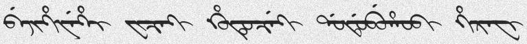
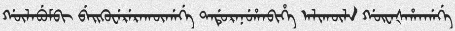
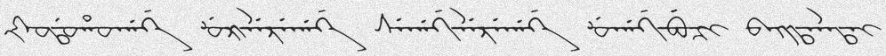
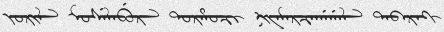
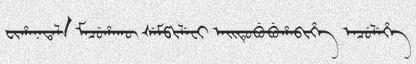
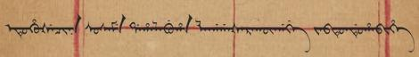
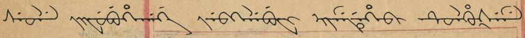

# ManchuTextRecognitionDataGenerator [](https://circleci.com/gh/Belval/TextRecognitionDataGenerator/tree/master) [](https://badge.fury.io/py/trdg) [](https://codecov.io/gh/Belval/TextRecognitionDataGenerator) [](https://textrecognitiondatagenerator.readthedocs.io/en/latest/?badge=latest)

A synthetic Manchu data generator for text recognition

## What is it for?

Generating Manchu text image samples to train an OCR software. Now supporting non-latin text! For a more thorough tutorial see [the official documentation](https://textrecognitiondatagenerator.readthedocs.io/en/latest/index.html).

## What do I need to make it work?

Install the pypi package

```
git clone https://github.com/Comet0322/ManchuTextRecognitionDataGenerator
cd ManchuTextRecognitionDataGenerator
pip install -r requirements.txt
pip install -e .
```

### Basic (CLI)

`trdg -l mc --word_split -c 1000 -w 5 -f 64`

You get 1,000 randomly generated images with random text on them like:







By default, they will be generated to `out/` in the current working directory.

### Background

Maybe you want another background? Add `-b` and A image from the images/ folder will be randomly selected and the text will be written on it. 






### Dictionary

The text is chosen at random in a dictionary file (that can be found in the *dicts* folder) and drawn on a white background made with Gaussian noise. The resulting image is saved as [text]\_[index].jpg

There are a lot of parameters that you can tune to get the results you want, therefore I recommend checking out `trdg -h` for more information.
